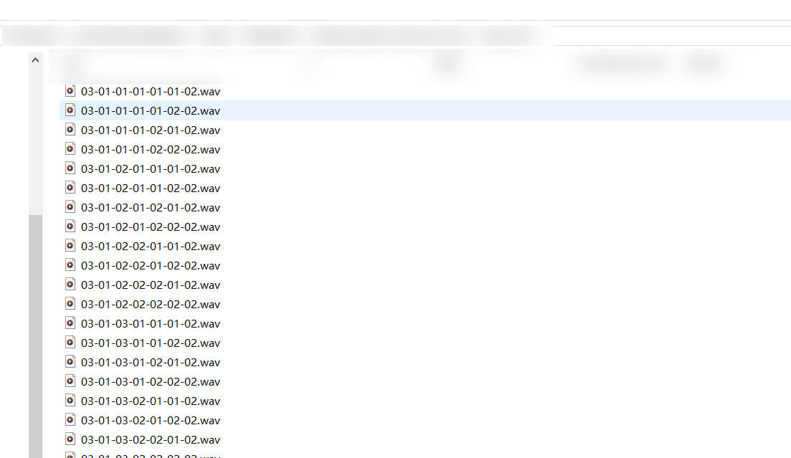
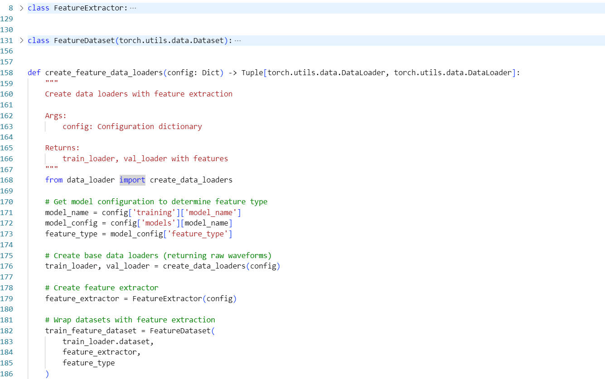
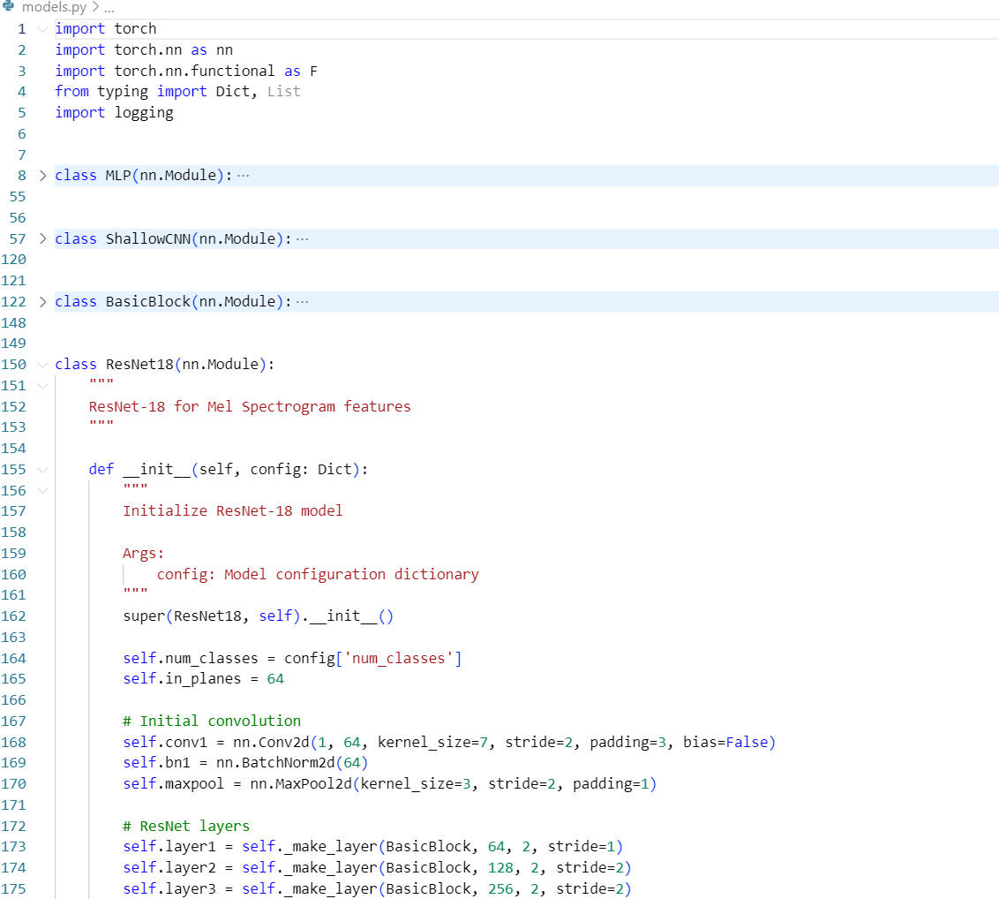

# Week 1 Progress Report - Speech Emotion Recognition Project

## Project Overview
Implemented a comprehensive Speech Emotion Recognition (SER) system using the RAVDESS dataset with three baseline models: MLP, Shallow CNN, and ResNet-18.

## Completed Tasks

### 1. Project Infrastructure & Configuration
- ✅ **Configuration System**: Created `config.yaml` for centralized parameter management
- ✅ **Project Structure**: Established modular codebase with clear separation of concerns
- ✅ **Dependencies**: Set up `requirements.txt` with all necessary packages
- ✅ **Documentation**: Comprehensive `README.md` with usage instructions

### 2. Data Processing Pipeline
- ✅ **RAVDESS Dataset Loader**: Implemented `RAVDESSDataset` class in `data_loader.py`
  - Automatic emotion label extraction from RAVDESS filename format
  - Support for both speech and song data
  - Stratified train/validation split (80/20) maintaining emotion distribution
  - Audio preprocessing (resampling, normalization, padding/trimming)
- ✅ **Data Statistics**:
  - Training samples: ~1,152 audio files
  - 8 emotion classes: neutral, calm, happy, sad, angry, fearful, disgust, surprised
  - 24 actors with balanced gender representation



### 3. Feature Extraction System
- ✅ **MFCC Features**: Implemented in `feature_extractor.py`
  - 13-dimensional MFCC coefficients
  - Statistical aggregation (mean + standard deviation)
  - Output shape: `(batch_size, 26)` for MLP model
- ✅ **Mel Spectrogram Features**:
  - 128 mel-filter banks
  - Log-scale amplitude conversion
  - Normalization to [0,1] range
  - Output shape: `(batch_size, 1, 128, time_frames)` for CNN models
- ✅ **Dynamic Feature Selection**: Automatic feature type selection based on model configuration


### 4. Model Implementation
- ✅ **MLP Model** (`models.py`):
  - Architecture: [128, 64, 32] hidden layers with ReLU activation
  - Dropout regularization (0.3)
  - Parameters: ~14,056
- ✅ **Shallow CNN Model**:
  - 3 convolutional layers with batch normalization
  - Global average pooling
  - Parameters: ~94,152
- ✅ **ResNet-18 Model**:
  - Standard ResNet-18 architecture adapted for single-channel input
  - Deep residual connections
  - Parameters: ~11,174,344


### 5. Training Framework
- ✅ **Trainer Class** (`trainer.py`):
  - Complete training/validation loop
  - Multiple optimizers support (Adam, SGD)
  - Learning rate scheduling (StepLR)
  - Early stopping mechanism (patience=10)
  - Model checkpointing with best model saving
- ✅ **Evaluation Metrics**:
  - Accuracy, Precision, Recall, F1-score (macro-averaged)
  - Confusion matrix visualization
  - Training history plots
- ✅ **GPU Support**: Automatic CUDA detection and utilization

### 6. Main Training Script
- ✅ **Command-line Interface** (`main.py`):
  - Model selection via arguments: `--model {mlp, shallow_cnn, resnet18}`
  - Hyperparameter override capabilities
  - Comprehensive logging system
  - System information reporting
  - Configuration validation

### 7. Testing & Validation
- ✅ **Setup Verification**: Created `test_setup.py` for environment validation
- ✅ **Component Testing**: Verified all modules work independently
- ✅ **Integration Testing**: Confirmed end-to-end pipeline functionality

## Technical Achievements

### Problem Resolution
- ✅ **Data Type Issues**: Fixed CrossEntropyLoss target format compatibility
- ✅ **Feature Dimension**: Resolved MFCC feature shape for MLP input
- ✅ **Logging System**: Implemented proper logging configuration with console and file output
- ✅ **Memory Optimization**: Efficient data loading with proper batch processing

### System Validation
- ✅ **Environment**: Tested on Windows 10 with Python 3.8.15, PyTorch 2.3.0+cu121
- ✅ **Hardware**: Successfully utilizing NVIDIA GeForce GPU
- ✅ **Performance**: Training proceeding smoothly with progress monitoring

## Current Status
- ✅ **All baseline models implemented and functional**
- ✅ **Training pipeline operational with real RAVDESS data**
- ✅ **Logging and monitoring systems working**
- ✅ **Ready for extended training and evaluation**

## Usage Examples
```bash
# Train MLP model with MFCC features
python main.py --model mlp

# Train Shallow CNN with Mel spectrograms
python main.py --model shallow_cnn

# Train ResNet-18 with custom parameters
python main.py --model resnet18 --batch-size 16 --epochs 100 --lr 0.0001
```

## Next Steps (Week 3)
1. **Complete baseline model training and evaluation**
2. **Performance analysis and comparison across models**
3. **Hyperparameter optimization**
4. **Begin Transformer-based model implementation (Conformer/AST)**
5. **Advanced data augmentation techniques**

## Files Created
- `config.yaml` - Configuration management
- `data_loader.py` - RAVDESS dataset handling
- `feature_extractor.py` - MFCC and Mel spectrogram extraction
- `models.py` - Three baseline model implementations
- `trainer.py` - Training and evaluation framework
- `main.py` - Main training script with CLI
- `test_setup.py` - Environment validation
- `README.md` - Comprehensive documentation
- `requirements.txt` - Project dependencies

## Summary
Weeks 1-2 successfully established a robust foundation for Speech Emotion Recognition research. All three baseline models are implemented and operational, with a complete training framework supporting configuration-driven experimentation. The system is ready for comprehensive baseline evaluation and advancement to more sophisticated architectures.
